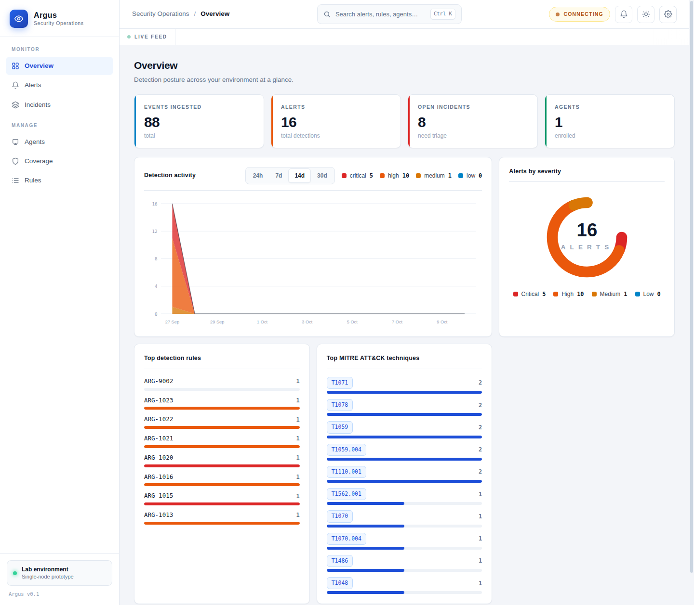
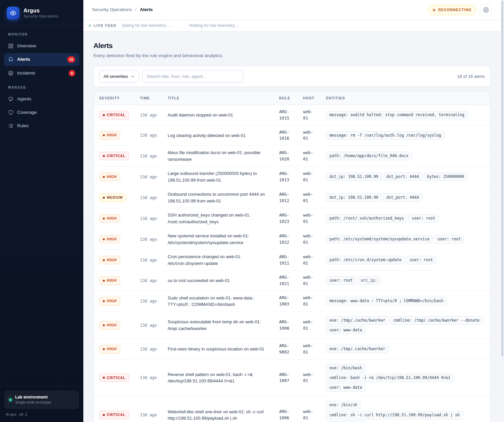
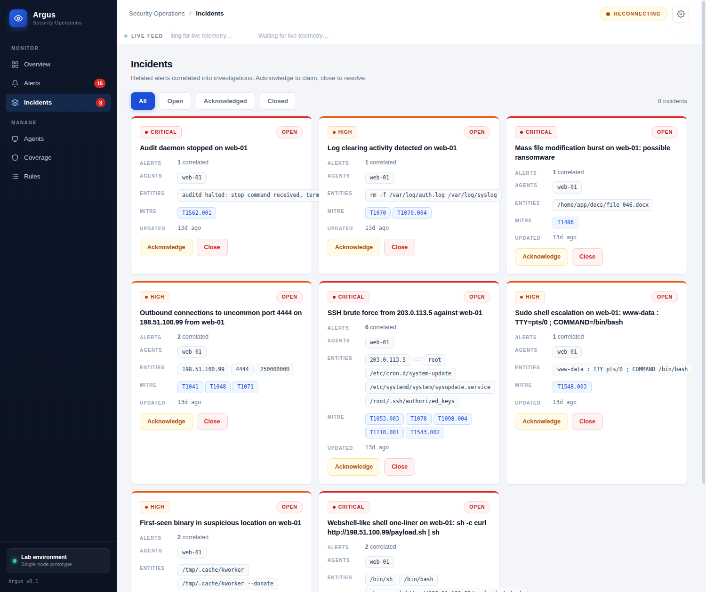
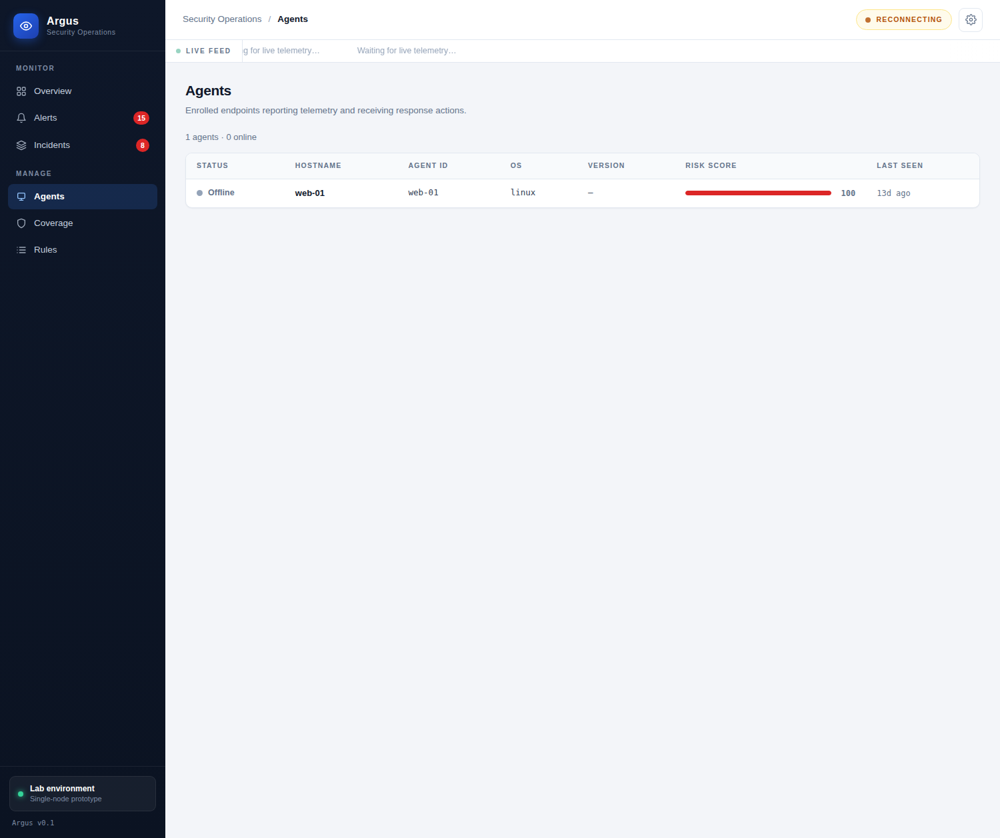
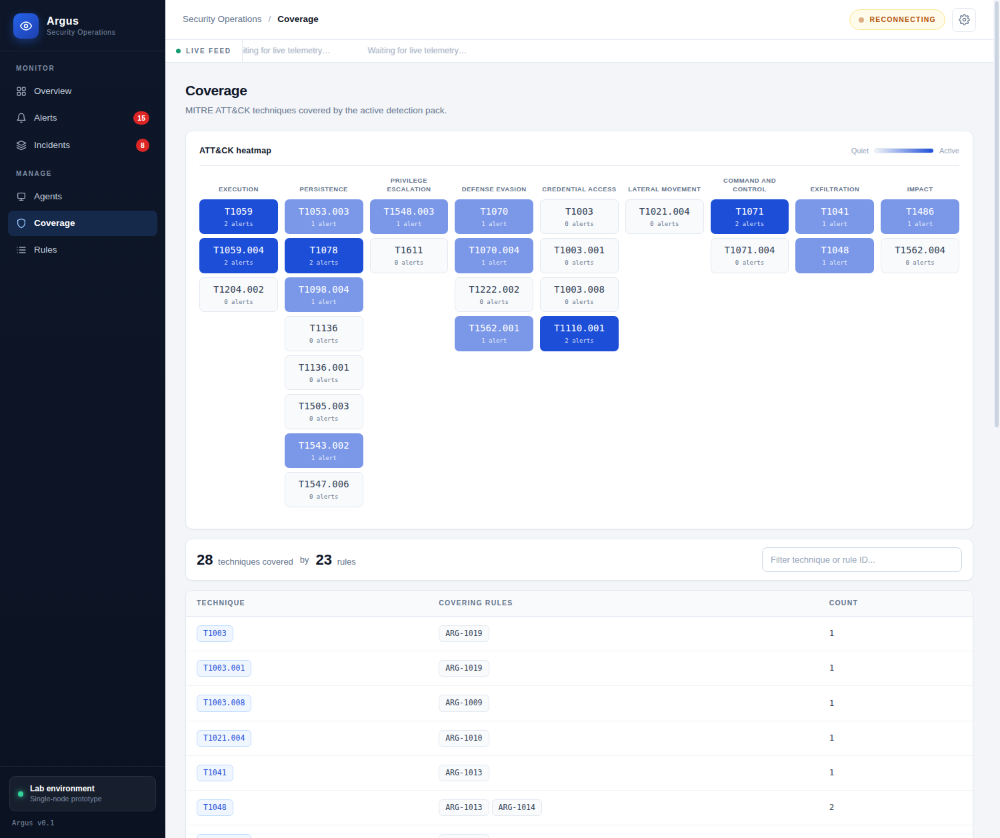
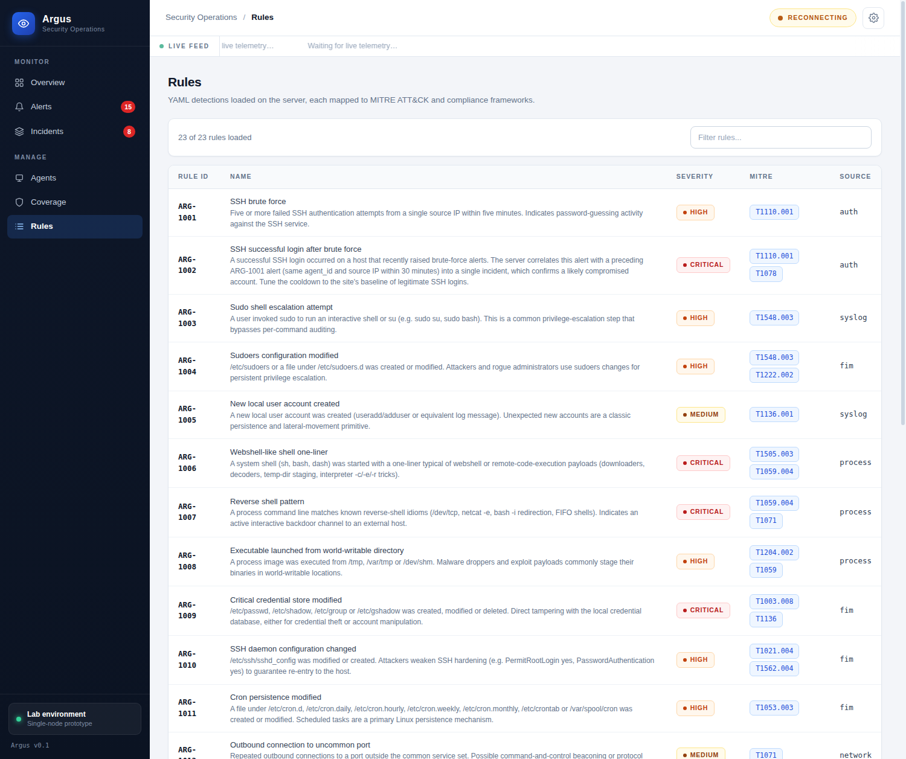
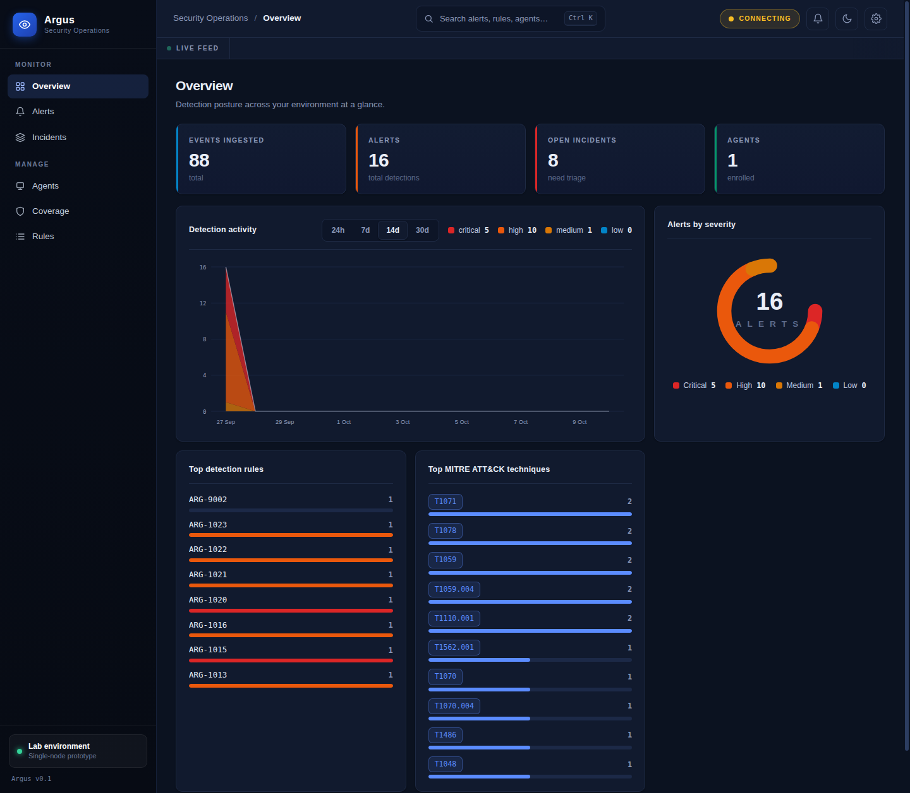

# Argus — a next-gen open SIEM/XDR prototype

Argus is what Wazuh would look like if it were designed today: a lightweight,
API-first security platform with the modern capabilities Wazuh still lacks —
**incident correlation**, **behavioral anomaly detection**, **threat-intel
auto-enrichment**, **AI alert triage**, **SOAR-lite playbooks**, and a
**real-time dashboard** — without the heavyweight C agent or the
Elasticsearch/OpenSearch stack.

> Prototype status: single-node, SQLite-backed, built for labs, demos, and
> learning. Not a production SOC platform (yet).

## Architecture

```
agent/        lightweight Python agent (stdlib only): log tailing, FIM,
              process + network collectors -> JSON events -> server;
              polls and executes response actions
server/       FastAPI: ingest -> rule engine -> anomaly baselines ->
              intel enrichment -> AI triage -> incident correlation ->
              playbook auto-response; REST + WebSocket API
dashboard/    real-time SOC dashboard (static, served by the server)
rules/        YAML detections, every rule tagged with MITRE ATT&CK +
              compliance (PCI DSS 4.0, GDPR, NIST 800-53)
playbooks/    YAML automated-response playbooks
simulator/    attack-scenario replay for demos and testing
```

## Quickstart (local)

```bash
cd argus
python3 -m venv .venv && .venv/bin/pip install -r server/requirements.txt

# terminal 1: server (http://localhost:8000)
.venv/bin/uvicorn server.app:app --port 8000

# terminal 2: replay a brute-force + webshell attack
.venv/bin/python simulator/simulate.py --all

# open http://localhost:8000  -> alerts, incidents, AI triage, live feed
```

API key: `argus-dev-key` (env `ARGUS_API_KEY`). The dashboard prompts for it once.

## Quickstart (docker)

```bash
docker compose up --build -d            # server on :8000
docker compose --profile demo up simulator   # replay attack scenarios
```

## Demo

Screenshots from a live run after replaying the attack scenarios
(`simulator/simulate.py --all`):


*Overview — event volume, alerts by severity, top detection rules and MITRE techniques.*


*Alerts — every detection with severity, rule, host and extracted entities.*


*Incidents — related alerts auto-correlated into attack stories with acknowledge/close workflow.*


*Agents — enrolled endpoints with live risk scores.*


*Coverage — MITRE ATT&CK heatmap plus the technique-to-rule mapping table.*


*Rules — the full YAML detection pack (28 rules) with severity, MITRE and compliance tags.*


*Dark mode — the whole console, including charts, in a refined dark theme.*

## Dashboard highlights

- **Light + dark enterprise themes** (toggle in the top bar, remembered per browser)
- **Command palette** (`Ctrl+K`): fuzzy search across alerts, incidents, rules, agents and views
- **Notification center**: unread badge for critical/high alerts and incident updates, persisted read state
- **Detection activity chart** with 24h / 7d / 14d / 30d ranges, stacked by severity
- **ATT&CK heatmap** on Coverage: techniques grouped by tactic, colored by live alert volume, click to filter
- **Richer alert drawer**: detection timeline, related alerts, AI triage, threat-intel enrichment
- **Bulk incident actions**: multi-select cards, acknowledge/close in one go
- **CSV export** of the filtered alert list
- **Live updates**: new alerts refresh charts, badges and the ticker over WebSocket

## What's new vs Wazuh

See [docs/WAZUH_COMPARISON.md](docs/WAZUH_COMPARISON.md) for the full
feature-gap table. Headlines:

| Wazuh today | Argus |
|---|---|
| Flat alert list, no grouping | Alerts auto-correlated into **incidents** |
| Pure signature rules | Rules **+ behavioral baselines** (UEBA-lite: unusual hours, first-seen binaries, concurrent IPs) |
| No built-in intel | **Auto-enrichment** (AbuseIPDB / VirusTotal / GreyNoise, offline mock fallback) |
| Raw alert JSON | **AI triage**: plain-English summary, why-it-matters, remediation steps |
| Basic active response | **Playbook engine** (block IP, quarantine, isolate, webhooks, SOC notify) |
| Polling dashboard | **WebSocket live feed** |
| Heavyweight C agent | **~600-line stdlib Python agent** |

## Project layout

- `docs/ARCHITECTURE.md` — event/rule/alert schemas and the full API contract
- `docs/RULE_AUTHORING.md` — write your own detections
- `docs/AGENT.md` — agent install, collectors, actions
- `docs/WAZUH_COMPARISON.md` — gap analysis vs Wazuh

## Tests

```bash
.venv/bin/python -m pytest tests/ -q
```
